# Git-graph

### Learn (or teach) Git fast and well - *by visualizing the inner graph of your Git repositories*
___

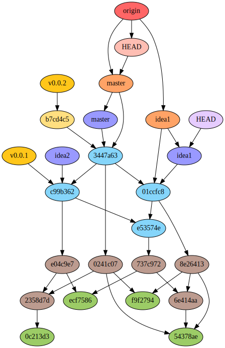

> [Git is a fast, scalable, distributed revision control system with an unusually rich command set
that provides both high-level operations and full access to internals.](https://git-scm.com/docs/git)

As wonderful as it may be, there is a downside coming with this "unusually rich command set", a kind of anxiety that affects beginners in particular and can be summed up in one question:
>"What the hell is going to happen to my repository if I launch this Git command ?"

A good way to overcome this difficulty is to experiment.
This is made easy thanks to Git lightness and the fact it is immediately up and running in any repository with `git init`.

Git-graph is a Git plugin, written in Python, that displays your Git repositories inner content as a Directed Acyclic Graph (DAG).
This structured visual representation of Git internal data demystifies the impact of each Git command and considerably improves the learning curve.

## Install

#### From PyPI
To install Git-graph from PyPI:
1. You first need to install [Graphviz](https://www.graphviz.org/download/) and check that the dot binary is correctly set in you system's path.  
2. Then run: 
    ```
    pip install git-graph
    ```

#### From GitHub
To install Git-graph from GitHub:
1. You first need to install [Graphviz](https://www.graphviz.org/download/) and check that the dot binary is correctly set in you system's path.  
2. Then run:
    ```
    git clone https://github.com/hoduche/git-graph
    ```
3. Finally, inside the newly created git-graph folder, run (with Python 3 and setuptools):
    ```
    python setup.py install
    ```

## Run

#### As a Git plugin
Git-graph is a Git plugin that is run at the root of a Git repository with the command:
```
git graph
```

Running `git graph` on a Git repository will:
1. scan you .git folder
2. build and save a graph representation of the .git folder internals as text (.dot) and image (pdf by default) in a .gitGraph folder
3. popup a window that displays the image of your graph

A color code helps in distinguishing in the graph the different kinds of object Git is using in its implementation:

| Object kind    | Letter | Representation                                     | Object kind    | Letter | Representation                                     |
| -------------- | :----: | -------------------------------------------------- | -------------- | :----: | -------------------------------------------------- |
| blob           | b      | 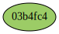                   | remote branche | r      | 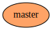 |
| tree           | t      | 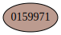                   | remote head    | d      | 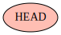     |
| commit         | c      | 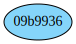               | remote server  | s      | 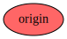 |
| local branche  | l      | 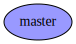   | annotated tag  | a      | 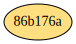 |
| local head     | h      | 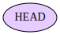       | tag            | g      | 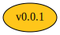                     |
| upstream link  | u      |            |

By default all nodes are displayed in the output graph when running `git graph`.
It is possible to only display a user selection of object kinds using the `-n` or `--nodes` option and picking the letters corresponding to your choice.   
For instance to only display blob, trees and commits:
```
git graph -n btc
```

By default Git-graph considers it is launched from the root of a Git repository (ie where a .git folder can be found).
It is possible to indicate the path to another Git repository with the `-p` or `--path` option:
```
git graph -p examples/demo
```

The default output format is pdf.
Other output graphics format (either vector or raster) can be set with the `-f` or `--format` option:  
(the full list of possible formats can be found on the [Graphviz documentation website](https://graphviz.gitlab.io/_pages/doc/info/output.html))
```
git graph -f svg
```

Finally it is possible to prevent the graph image from poping up once constructed with the `-c` or `--conceal` option:
```
git graph -c
```

#### As a Python program
```
python git_graph/dot_graph.py -p examples/demo -n btc -f svg
```
or
```
./git_graph/dot_graph.py -p examples/demo -n btc -f svg
```
    
#### As a Python module

```python
import git_graph.dot_graph as dg
dg.DotGraph('..').persist()
dg.DotGraph('../examples/demo', nodes='btc').persist(form='svg', conceal=True)
```
